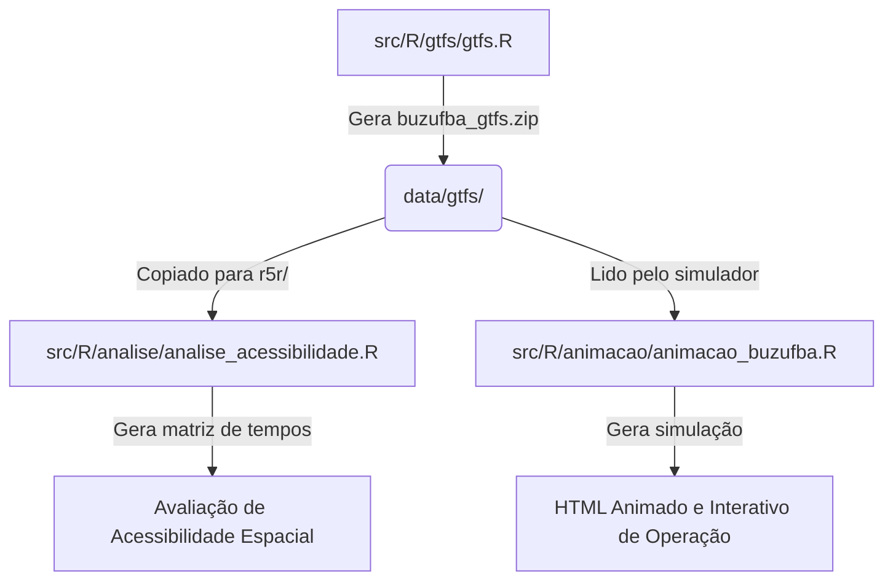

# 🚌 BUZUFBA GTFS & Multimodal Accessibility Pipeline

> **Geração programática de dados GTFS e análise de acessibilidade de transporte ativo e coletivo para a Universidade Federal da Bahia (UFBA).**

---

[](https://www.r-project.org/)
[](https://gtfs.org/)
[](https://github.com/ipeaGIT/r5r)
[](https://opensource.org/licenses/MIT)

Este repositório hospeda um pipeline completo de Engenharia de Dados de Transporte e Planejamento Urbano. Ele foi desenvolvido para mapear programaticamente o **BUZUFBA** (sistema de transporte interno da UFBA), gerar um feed padronizado **GTFS**, construir uma rede de transporte multimodal e realizar simulações e análises espaciais de acessibilidade urbana aos campi da universidade.

---

## 📌 Índice
- [1. Sobre o BUZUFBA](#sobre)
- [2. Rotas Operacionais](#rotas)
- [3. Arquitetura do Repositório](#arquitetura)
- [4. Requisitos de Infraestrutura & Software](#requisitos)
- [5. Como Utilizar o Pipeline](#como-utilizar)
  - [Etapa 1: Geração de GTFS](#etapa-1-geração-de-gtfs)
  - [Etapa 2: Análise de Acessibilidade Espacial](#etapa-2-análise-de-acessibilidade-espacial)
  - [Etapa 3: Animação e Simulação Dinâmica](#etapa-3-animação-e-simulação-dinâmica)
- [6. Como Contribuir](#como-contribuir)
- [7. Licença](#licenca)

---

<a id="sobre"></a>

## 🚌 1. Sobre o BUZUFBA

O **BUZUFBA** é o sistema de transporte coletivo e gratuito que atende a comunidade acadêmica da Universidade Federal da Bahia em Salvador-BA. Ele atua como um elemento crucial de permanência estudantil e integração urbana, conectando faculdades, institutos de pesquisa, residências universitárias e pontos estratégicos de transporte da cidade ao longo de 5 rotas circulares operadas durante os dias úteis e sábados.

---

<a id="rotas"></a>

## 🗺️ 2. Rotas Operacionais

O sistema é modelado com base nas seguintes linhas circulares principais:

| Rota | Nome do Itinerário | Descrição / Conexões Chave |
| :---: | :--- | :--- |
| **B1** | Ondina - Canela - São Lázaro | Conecta o Campus de Ondina ao Canela e ao topo da colina de São Lázaro (FFCH). |
| **B2** | Ondina - Canela - Vitória - Graça | Atende a reitoria, corredor da Vitória, Graça e o vale do Canela. |
| **B3** | Ondina - Garibaldi - Canela - Av. 7 de Setembro | Rota expressa ligando Ondina ao Canela via Av. Garibaldi. |
| **B4** | Ondina - Piedade - Vitória - Graça | Rota que passa pela Piedade para atender à Faculdade de Economia. |
| **B5** | Federação - Ondina - Canela - Vitória | Conecta o campus da Federação (Engenharia/Arquitetura) a Ondina e Canela. |

---

<a id="arquitetura"></a>

## 📂 3. Arquitetura do Repositório

O projeto é estruturado de forma lógica para separar dados brutos, modelos gerados e scripts executáveis:

```text
buzufba-gtfs/
├── data/                               # Armazenamento central de dados
│   ├── edificacoes/
│   │   └── edif_ufba.gpkg              # Malha espacial das edificações e unidades da UFBA (Geopackage)
│   ├── gtfs/
│   │   └── buzufba_gtfs.zip            # Feed GTFS final gerado e exportado pelo pipeline
│   ├── pbf/
│   │   └── ufba.pbf                    # Rede de ruas e calçadas do OpenStreetMap (extrato UFBA)
│   ├── r5r/                            # Diretório de rede multimodal para a engine R5R
│   │   ├── buzufba_gtfs.zip            # GTFS copiado para acoplamento na rede multimodal
│   │   ├── salvador_mde.tif            # Modelo Digital de Elevação (MDE) para ajuste de esforço de caminhada/bike
│   │   ├── ufba.pbf                    # Cópia do OSM para o roteamento do R5
│   │   └── network.dat                 # Rede de transporte multimodal compilada pelo R5R (Gerada automaticamente)
│   └── tif/
│       └── salvador_mde.tif            # Arquivo raster original de relevo
├── notebooks/
│   └── documentacao_script_gtfs.qmd    # Notebook Quarto contendo análises interativas e documentação do fluxo
├── src/                                # Código-fonte do projeto
│   └── R/
│       ├── analise/
│       │   └── analise_acessibilidade.R # Avaliação de matriz de tempo de viagem e acessibilidade usando r5r
│       ├── animacao/
│       │   └── animacao_buzufba.R       # Geração de um mapa animado e interativo em HTML do BUZUFBA
│       └── gtfs/
│           └── gtfs.R                   # Script core que constrói e exporta o feed GTFS válido
├── README.Rmd                          # Código fonte da documentação (R Markdown)
└── README.md                           # Documentação renderizada para consumo imediato
```

---

<a id="requisitos"></a>

## 🛠️ 4. Requisitos de Infraestrutura & Software

Devido à integração com o **R5** (uma engine de roteamento de alto desempenho escrita em Java), os requisitos deste repositório vão além das bibliotecas tradicionais de R:

### Requisitos do Sistema
1. **Java Development Kit (JDK) 11 ou 21:** Necessário para o funcionamento do motor de roteamento multimodal `r5r`. Certifique-se de que a variável de ambiente `JAVA_HOME` está devidamente configurada.
2. **Conexão com a Internet:** Requerida para a primeira compilação da rede OSRM e download de dependências geográficas.

### Instalação de Pacotes R

Abra o console do R e execute as instruções abaixo de acordo com sua necessidade:

#### Dependências de Geração do GTFS (`src/R/gtfs/gtfs.R`)
```r
install.packages(c("gtfstools", "tidyverse", "data.table", "osrm", "sf", "mapview"))
```

#### Dependências de Roteamento e Acessibilidade (`src/R/analise/analise_acessibilidade.R`)
```r
install.packages(c("r5r", "sf", "dplyr", "ggplot2", "ggspatial", "viridis", "r5rgui", "tidyr", "scales", "forcats"))
```

#### Dependências de Animação e Simulação (`src/R/animacao/animacao_buzufba.R`)
```r
install.packages(c("tidytransit", "dplyr", "lubridate", "leaflet", "leaftime", "geojsonio", "htmlwidgets", "stinepack", "sf"))
```

---

<a id="como-utilizar"></a>

## ⚙️ 5. Como Utilizar o Pipeline

O pipeline foi desenhado para ser executado de forma sequencial, onde cada etapa gera insumos para a subsequente.



### Etapa 1: Geração de GTFS
O script `src/R/gtfs/gtfs.R` monta de maneira programática todas as tabelas mandatórias e opcionais do padrão GTFS (`agency`, `routes`, `stops`, `trips`, `stop_times`, `calendar`, `shapes`, `feed_info`). O traçado geográfico exato das vias e paradas utiliza chamadas para a API do **OSRM** para garantir curvas realistas nas avenidas de Salvador.

```r
source("src/R/gtfs/gtfs.R")
```
*Insumo Gerado:* `data/gtfs/buzufba_gtfs.zip`
*Documentação do Script:* O script em R do GTFS foi documentado e pode ser acessado através do [link](https://01a08be6-dcfd-7112-31db-cec7d0804ee0.share.connect.posit.cloud/).

### Etapa 2: Análise de Acessibilidade Espacial
Usando o motor `r5r` acoplado ao modelo de elevação digital (`salvador_mde.tif`), ao OpenStreetMap (`ufba.pbf`) e ao nosso GTFS recém-gerado, este script calcula as curvas de tempo de viagem de pedestres saindo de todas as unidades acadêmicas (`edif_ufba.gpkg`) para os pontos do BUZUFBA, levando em conta o relevo acidentado de Salvador.

```r
source("src/R/analise/analise_acessibilidade.R")
```
*Insumo Gerado:* Matrizes de tempo de viagem e relatórios de acessibilidade espacial integrados.

### Etapa 3: Animação e Simulação Dinâmica
O script `src/R/animacao/animacao_buzufba.R` converte o feed estático GTFS em coordenadas espaço-temporais (usando algoritmo de interpolação) e renderiza uma animação mostrando o comportamento estimado da frota ao longo de um dia de operação.

```r
source("src/R/animacao/animacao_buzufba.R")
```
*Insumo Gerado:* HTML animado e interativo de alta resolução mostrando os ônibus trafegando ao longo das vias urbanas. A página pode ser acessada através do [GitHub Pages](https://gabrielcury30.github.io/buzufba-gtfs/) do projeto.

---

<a id="como-contribuir"></a>

## 🤝 6. Como Contribuir

Ficamos muito felizes com o seu interesse em melhorar o projeto! Para contribuir:

1. Faça um **Fork** deste repositório.
2. Crie uma branch para sua modificação: `git checkout -b feature/minha-melhoria`.
3. Certifique-se de que suas modificações não quebraram os scripts de teste e geração de dados.
4. Envie um **Pull Request**.

---

<a id="licenca"></a>

## 📝 7. Licença

Este projeto é disponibilizado sob a Licença **MIT**. Sinta-se livre para adaptar, redistribuir e aplicar estes dados e rotinas para pesquisas e planejamentos urbanos adicionais.

---

*Desenvolvido e mantido com foco em reprodutibilidade científica e mobilidade ativa.*
